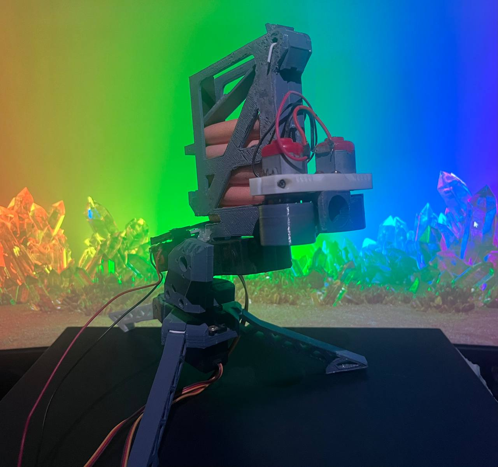
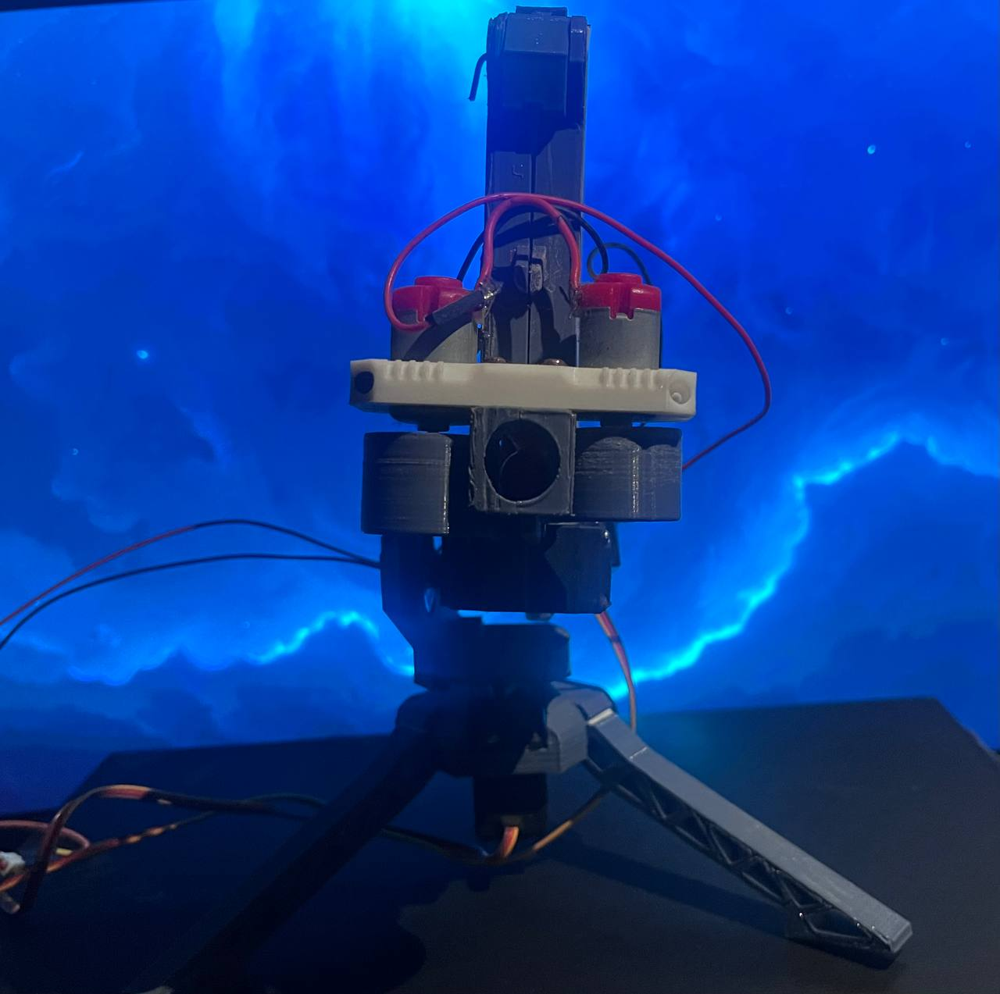
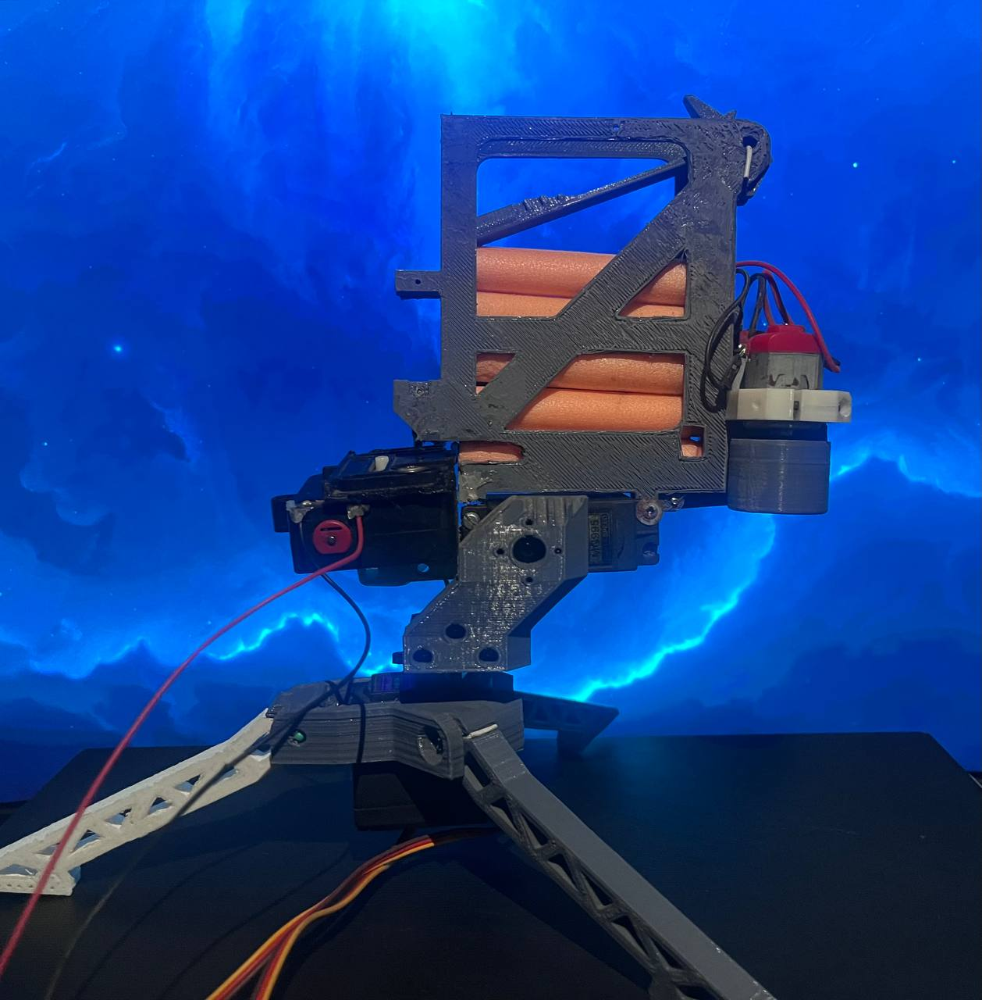

# AutoLocker

> ### Vision-Guided Robotic Perception and Embedded Control Platform

<p align="center">
  
</p>

<p align="center">


</p>

---

## 🎥 Demonstration

<p align="center">
  
</p>


---

# Overview

AutoLocker is a vision-guided robotic perception platform designed to explore the integration of computer vision, embedded systems, and real-time robotic actuation. The project demonstrates a complete **perception → decision → action** pipeline by combining OpenCV-based face detection, embedded servo control, and a mechanically actuated launcher into a single autonomous robotic system.

A laptop performs real-time visual perception using OpenCV's Deep Neural Network (DNN) face detector. The detected face is localized within each frame and converted into pan and tilt commands, which are transmitted over USB serial communication to an Arduino Uno. The Arduino controls a two-axis pan-tilt mechanism, continuously orienting the platform toward the detected target.

To demonstrate perception-driven actuation, the system incorporates a launcher consisting of two DC flywheel motors and a linear actuator. Once the target is detected and tracked, the Arduino coordinates the launcher subsystem by feeding a foam dart into the rotating flywheels.

Although the launcher serves as the demonstration payload, the primary objective of AutoLocker was to investigate the integration of perception, communication, embedded control, and mechanical actuation within a complete robotic platform.

---

# Motivation

Modern robotic systems require the seamless interaction of sensing, perception, embedded control, communication, and physical actuation. Rather than studying these components independently, AutoLocker was developed as a complete end-to-end robotic platform.

The project provided practical experience in:

* Computer Vision
* Embedded Systems
* Robotics
* Mechatronics
* USB Serial Communication
* Real-Time Control
* Hardware–Software Integration
* Mechanical Design

The knowledge gained through AutoLocker later served as the foundation for more advanced autonomous robotics projects.

---

# Features

* Real-time face detection using OpenCV DNN
* Autonomous visual target tracking
* Two-axis pan-tilt control
* USB serial communication
* Arduino-based embedded controller
* Dual flywheel launcher mechanism
* Linear actuator feeding system
* Servo smoothing for stable tracking
* CUDA acceleration support (when available)

---

# Hardware Components

| Component       | Purpose              |
| --------------- | -------------------- |
| Laptop          | Vision Processing    |
| Laptop Webcam   | Image Acquisition    |
| Arduino Uno     | Embedded Controller  |
| Pan Servo       | Horizontal Tracking  |
| Tilt Servo      | Vertical Tracking    |
| 2 × DC Motors   | Flywheel Launcher    |
| Linear Actuator | Foam Dart Feeding    |
| USB Cable       | Serial Communication |

---

# Software Stack

* Python
* OpenCV
* OpenCV DNN Face Detector (ResNet-10 SSD)
* NumPy
* PySerial
* Arduino IDE

---

# Hardware Gallery

<p align="center">




</p>

---

# System Architecture

<p align="center">

</p>

The system is divided into three primary subsystems:

* **Perception Layer** : OpenCV DNN-based face detection and localization.
* **Communication Layer** : USB serial communication between the host computer and Arduino Uno.
* **Embedded Control Layer** : Low-level servo control and launcher actuation.

This modular architecture separates computationally intensive vision processing from time-sensitive embedded motor control.

---

# Software Pipeline

<p align="center">

</p>

Each camera frame passes through the following processing stages:

1. Image acquisition
2. Blob generation
3. OpenCV DNN face detection
4. Highest-confidence face selection
5. Face center localization
6. Pan–tilt angle computation
7. Servo smoothing
8. Serial command transmission
9. Embedded execution

---

# Control State Machine

<p align="center">

</p>

The robot operates using a finite-state machine that transitions between idle, detection, tracking, actuation, and reset states depending on visual feedback.

---

# Installation

```bash
git clone https://github.com/GargeyaOHKO/AutoLocker.git

cd AutoLocker

pip install -r requirements.txt
```

---

# Running the Project

1. Upload the Arduino sketch to the Arduino Uno.
2. Connect the Arduino to the host computer.
3. Place the DNN model files inside the `models/` directory.
4. Update the serial port in `face_tracking_dnn.py`.
5. Run:

```bash
python Python/face_tracking_dnn.py
```

---

# Results

AutoLocker successfully demonstrates:

* Real-time face detection
* Autonomous visual tracking
* Smooth pan–tilt control
* Embedded robotic actuation
* End-to-end perception-to-action integration

---

# Engineering Challenges

Throughout development, several engineering challenges were encountered:

* Servo oscillations during rapid target movement
* Serial communication latency
* Camera frame rate limitations
* Variable lighting conditions affecting detection accuracy
* Mechanical alignment of the launcher subsystem
* Synchronization between perception and actuation

Addressing these challenges significantly improved the robustness and reliability of the platform.

---

# Future Improvements

Future versions of AutoLocker could include:

* Raspberry Pi onboard processing
* ROS 2 integration
* PID-based pan–tilt control
* Kalman filter target prediction
* Multi-object tracking
* Stereo or depth cameras

---

# Author

**Gargeya Parab**

Incoming **M.S. Electrical and Computer Engineering**
**Intelligent Systems, Robotics, and Control (ISRC)**
University of California San Diego

---

## License

This project is released under the MIT License.
